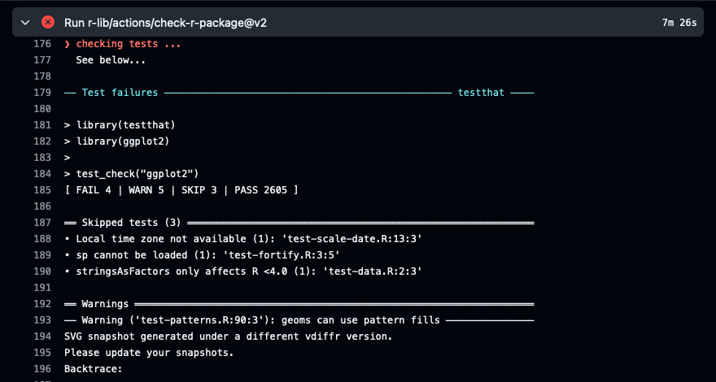

Automated testing is so much more than just catching bugs or making sure there's that green status bar on CI.

Doing automated testing, if done right, can give us plenty of benefits, but on the other hand, if done wrong, it can hamper the speed of software delivery.

Since I joined Appsilon over 3 years ago I’ve been learning, experimenting and improving the ways we can test R code. I worked across many different projects, from creating small, Shiny app prototypes delivered in 2 weeks, to projects spanning many months, with multiple developers and changing requirements. I’ve seen how testing can help us deliver better software. I've also seen how testing can be a burden, when done wrong.

And after all this time, I made my own contribution to the R community, by creating the  {cucumber} package, whose goal is to help write high-level, user-behavior focused tests.

I really like testing. I love the idea of self-verifying code. But I don't test all of my code. I try to be intentional with what I test and what I don't.

When coming into testing we should ask ourselves: should I test it, is it worth it?

Spoiler alert: sometimes it does, sometimes it doesn't.

Let's see what I mean by that and how to make sure that we get the most out of our investment in automated testing.

## Economics of Test Automation

Development teams can add automated tests along the way (which is more of the Agile way of creating software), they can add it after writing the software (which is the "classic", Waterfall approach), or they could even not do it themselves and outsource testing to a separate QA team.

No matter what the approach is, the same rules apply:
- Writing good test code is difficult, it takes a while to learn.
- But what also applies is maintaining bad test code is harder.

### Good tests

Introduction of automated testing has its costs. It takes time to learn testing, it takes time to write and maintain tests. We need to be aware of those costs.


It might be tempting to skip on testing in the early stages of the project, but it might be a costly mistake.

Development without testing might be faster at the beginning, but as the project goes on, there should be a point when the initial investment of writing tests starts to pay off.

We have built good tests when the additional cost of building and maintaining automated tests is offset by savings through reduced manual testing. It should be offset by savings on debugging and troubleshooting as well as the remediation cost of the defects that would have gone undetected until the formal test phase or early production usage of the software.

Having good tests in place we can channel our resources away from manual testing to delivering value.

### Bad tests

But what happens if we don't succeed in building good tests?

Well, this can be discovered only on the later stages of the project, only when the test suite becomes large. In this scenario, tests become a burden, and can halt the development process as changing the production code requires changing a ton of tests.


If tests become too difficult or time consuming to maintain, it’s easy to give up on adding them. We might be even tempted to remove some of the test code as it’s not possible to change it.

This situation is dangerous and it slowly creeps in, it might be hard to notice it early, but there are heuristics that can help us see and avoid it, like the [Testing Pyramid](https://www.martinfowler.com/articles/practical-test-pyramid.html) and separation of concerns.

### Automate testing or not?

Building automated testing has its cost. Maintaining the test code has its cost. But not having automated tests also has its cost.

As with everything there are tradeoffs.

So what are the other benefits of automated testing, other than possible costs saving on manual testing? What else could make it worth it?

## Why test?

What we could get from automated testing could be categorized as follows:

- Better code quality
- Documentation
- Reproducibility
- Scalability
- Reliability

## Better code quality

There are 2 facets to the quality of software:
- Have we built the correct software?
- Have we built the software correctly?

### Tests as Specification

If we are practicing a development process in which we write tests before writing production code, tests give us a way to capture what we expect from the system before we build it.

Tests allow us to define the system's behavior across different scenarios in a format that can be executed. To ensure we're "building the right software," it's essential that our tests accurately reflect how the system will be used in practice.

Thinking through these scenarios in sufficient detail to turn them into tests helps uncover areas where the requirements may be unclear or contradictory.

In this sense tests help us reduce the risk of building the wrong thing.

#### Example

Let's imagine we want to allow users to get insights about the subjects in a given clinical trial.

We could start with this vague idea captured as a User Story:

> As a User I want to see a visual representation of the subjects in a clinical trial so that I can easily understand characteristics of the population in the study

This is vague and it can't possibly be translated into software. We need to break it down into smaller, more precise pieces.

We might start with thinking what those visuals should be, what data should be displayed, how the user should interact with it.

We might end up with a list of requirements like:

- > As a User I want to see a histogram of subjects by treatment group.
- > As a User I want to see a distribution of subjects' age.
- > As a User I want to see all subjects belonging to a specific treatment group.

Those requirements are still a bit vague, but now we are more specific what value we want to provide to the user, we have a clearer idea of what we want to achieve.

The next step in making those specifications the most precise, to make them translatable into tests would be to create examples of what we want to achieve.

We could write those scenarios using a specific language called Gherkin, which is a language that can be used in Behavior-Driven Development (BDD). It contains specific keywords like `Given`, `When`, `Then` that help us structure the scenarios.

```gherkin
Feature: Patient demographics
  Scenario: A User wants to see subjects for a "Treatment Group A"
    Given I select the "Full Analysis Set" for the "Study 123"
    When I select the "Treatment Group A"
    Then I should see 10 subjects
```

When working on examples like this, with real values, we'll discover what exactly we need in order to implement this feature.

For example, in previous versions of requirements we didn't realize that without specifying the study and the population we can't display the subjects.

This is an outside-in approach to testing, when we start with the user's perspective and work our way down to the implementation details.

At this level, we don't even know if this is a Markdown report or a Web app or a Neuralink that uploads images to the mind of the user. And that's the point. We don't care about the implementation details. We care about the user's perspective, if they can get what they need, not how they get it.

That type of tests can be implemented with just {testthat} package or with {cucumber}.

### BDD and the pyramid

This approach to development and testing is called Behavior-Driven Development (BDD), as it puts high emphasis on satisfying users needs, and it's a method to ensure that we are building the right software, while unit tests of individual functions ensure that we are building the software correctly.


## Documentation

I bet you've at least once come across a situation when you wanted to use a piece of code, looked at how it's used in one context and wanted to apply it in another, but it didn't work as expected. If not, you're lucky.

Tests can help us understand how the code is supposed to work, by showing us how the code works in expected and unexpected scenarios.

Even better, with tests there's an easily accessible place where the code runs. If we're not satisfied with the examples, we can plug-in, run the debugger and see step-by-step how the code works.

How's that different from just documentation?

Examples in documentation can easily get outdated and misleading. That's why by default in R packages, examples in function documentations are run during package checks. But just running examples won't assert that they are working correctly.

Tests can be the most precise documentation, because not only they check if the code runs, but if it runs correctly.

## Reproducibility

Mistakes happen, there's no way around it. It's what we do about this fact that matters.

When a bug is found in the software, we need to know what caused it.

If we have made our unit tests fairly small by testing only a single behavior in each, we should be able to pinpoint the bug pretty quickly based on which test is failing.

This is one of the big advantages of unit tests over manual tests. The manual test will tell us that some behavior expected by the user isn't working. The unit test will tell us why.

</img>

We call it Defect Localization, tests should not only tell us that something is wrong, but also tell us precisely what failed, making the fix easier, as we save time on debugging and searching.

But this only comes when we write good tests and there's enough of them. If there was a bug that wasn't caught, it's time to add a test for it.

All of those benefits we get from tests are wonderful, but we won't get them if we don't write tests which we can trust. It's critical that tests are as simple as possible, so that there are no bugs in test code itself.

Another facet of reproducibility is that tests show us what's been implemented and they're proof that the software works.

When we have a test suite that covers all the features of the software, we can be confident that the software works as expected as it has already run in a specific environment.

If we're running our test suite in CI (as you always should), we have snapshots of exact circumstances in which the software is runnable and that it runs as expected.

## Scalability

Tests affect scalability in the context of growing the codebase.

Making changes in a codebase without automated tests is a risky business. We never know if our change doesn't break something. Even if we're very careful, we might miss something. Even if we check the output manually and everything looks fine, we might've made mistakes when checking. And even if we haven't, something might still come up later as a new scenario comes up.

This risk forces us to go very slowly, but even then we're not 100% secure.

When relying on manual testing, it's easy to get very conservative about introducing changes, even the simple ones. And when deadlines are tight and resources for manual testing are scarce, we might decide to skip some changes or do a quick check and hope for the best.

Imagine your team implements an optimization of the app that shouldn't change the behavior of the app, and could be introduced with a new release to deliver value to its users. But since there are no automated tests, and the deadline is tight, the team is afraid to merge it because they don't know what could break. They decide to skip the optimization and deliver the app without it. This is a lost opportunity to improve the app.


When working with code that has a good test suite we can work much more quickly. We can be bolder about introducing changes, because we know that if we break something, we'll know about it quickly. We can be more confident that the changes we introduce won't break anything.

### Code coverage can be a measure of confidence

We can easily learn how much code we exercise during tests with packages like {covr}. Code coverage can give us a good idea of how much of the code is tested and how much is not, but there are some caveats to this approach. We can have 100% code coverage and still have bugs in the code. We can have 0% code coverage and have no bugs in the code. Code coverage is a useful metric but it is not a guarantee of quality. It just checks how much code was exercised, it doesn't verify the quality of the tests.

Let's take advice from Kent Beck, the creator of Extreme Programming:

> "I get paid for code that works, not for tests, so my philosophy is to test as little as possible to reach a given level of confidence" – Kent Beck

and find a balance between the amount of tests and the confidence we get from them.

The effectiveness of the safety net is amplified by the version control. If we go in small steps, we can do bold changes, fail fast, improve or roll-back if needed.

## Reliability

Yes, tests can help us find bugs, but that isn't their core purpose. When we talk about tests and bugs, we talk about preventing bugs from happening.

Every person that has ever written code, must've introduced an error at some point, even as easy as a typo.

Automated tests are bug repellent in a sense that they keep us safe from the effects of mixups as simple as typos from crashing the software in production. When we have a good code surface covered by tests, we can be more confident that the changes we introduce won't break anything. Provided we run our tests before checking in our changes to the codebase.

#### Example

We might have changed something about how we handle the ADSL data and now the table is affected. If we have a test that checks the rendering of a table, we'll know that something is wrong and can investigate the issue.

<!-- import video from "./snapshot_review.mp4"; -->

With testthat we can easily create tests even for non-trivial outputs like images.

### Efficiency of automated testing

The other aspect of reliability is that tests can help us reduce the risk related to verifying the behavior of the software in highly improbable circumstances that cannot be easily created when doing manual testing.

Those could be some inputs that will be provided once in a million. Or this could be a test of what would happen if there are 10 users at the same time, but we only have 2 testers available.

So in a sense, just as the [High Throughput Screening Robotics Platform](https://hts.scripps.ufl.edu/facilities/hts-robotics/), automated tests can probe a vast combinations of inputs and states that would be very difficult to manage manually. Automated tests will do this job more reliably, more quickly, and more cheaply than manual testing.

### Defense against changes from outside

Another important aspect of reliability is that tests can help us protect against changes in our dependencies.

R is open-source and its power comes from the vast ecosystem of packages. When we use those packages, we rely on the maintainers of those packages to keep them up-to-date and bug-free. We need to trust them that they work correctly and won't break our code.

Code is a live thing, it changes, it evolves. And when we rely on external packages, we need to be sure that the changes in those packages won't break our code.

When we have a good test suite, we can be confident that the changes in the dependencies won't break our code. We can run our tests after updating the dependencies and see if everything still works as expected. If something breaks, we can fix it now, instead finding it out in production.

## Good Automated Testing

We went through 5 major types of benefits we can get from Good Automated Testing:

- Better code quality
- Documentation
- Reproducibility
- Scalability
- Reliability

Those benefits come at a cost. We need to invest time in learning how to write good tests, we need to invest time in writing good tests, we need to invest time in maintaining tests.

Testing is not reserved to specialized software engineering teams. They are for everyone who writes code and looks for ways to improve the quality of their work.

What's important is to come to automated testing with a clear goal in mind. We need to know what we want to achieve with tests and not do them just for the sake of getting a green light on CI or a specific level of code coverage.

## What's next?

Testing, just as with coding, is something you need to learn. And to get better at it you need to practice.

Getting more effective at something is also a matter of tools. I think in the R community, there's an unspoken rule:

> If a problem exists, there's a package for it. If not, you should write one.

The need in pharma has sparked pharmaverse. There are already packages that help with accessing the safety of a package or reproducibility.

The same things can happen with testing. There are already some efforts in this direction.

[{verifyr2}](https://github.com/ejuhjav/verifyr2) is a package for comparing rtf files.

There is also a [{shinyValidator}](https://opensource.nibr.com/shinyValidator/) package that aims at combining multiple checks of Shiny apps into a single report for easier validation.

What innovations could we see in the future? I'm not sure, but I'm excited to see them.

Thank you.
