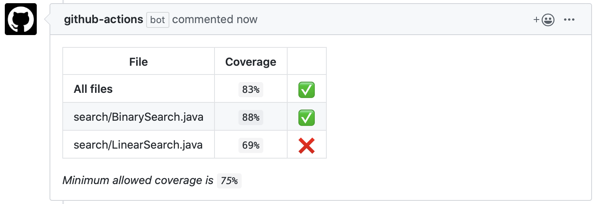

In R the most popular way to get the code coverage report is to use [codecov.io](https://about.codecov.io/) with [`usethis::use_coverage`](https://usethis.r-lib.org/reference/use_coverage.html).

It reports the coverage in a nice badge you can attach to the README.

But you can also get a coverage report with a [cobertura-action](https://github.com/5monkeys/cobertura-action):
1. Create a step in CI to calculate the coverage with {covr} and convert it to the cobertura xml format with `covr::to_cobertura`.
2. Add `5monkeys/cobertura-action@master` step that reads the produced xml file and adjust other parameters as needed.

```yaml
- name: Test coverage
  run: |
    renv::install(c("covr", "xml2"))
    cov <- covr::package_coverage(
      quiet = FALSE,
      clean = FALSE,
      install_path = file.path(normalizePath(Sys.getenv("RUNNER_TEMP"), winslash = "/"), "package")
    )
    covr::to_cobertura(cov, filename = "covr.xml")
  shell: Rscript {0}

- uses: 5monkeys/cobertura-action@master
  with:
    path: ./covr.xml
    minimum_coverage: 75
    only_changed_files: true
```

The action will post a comment in a PR with coverage result after a successful run.



The downside of using this action instead of `codecov.io` is that it shows only a summary of coverage, while with `codecov.io` you can see the coverage of each file. But if you don't want to share your private code with this external service, this is a good alternative.

You can always create a more detailed report locally or export it as an artifact from CI.

I highly recommend setting up coverage report in your project, one way or the other, especially when dealing with legacy code. This way you can continuously get feedback how well you're doing in your testing efforts.

But remember, hoverer many tests you have, they don't prove your system is good.

Find the coverage that makes you feel comfortable.
