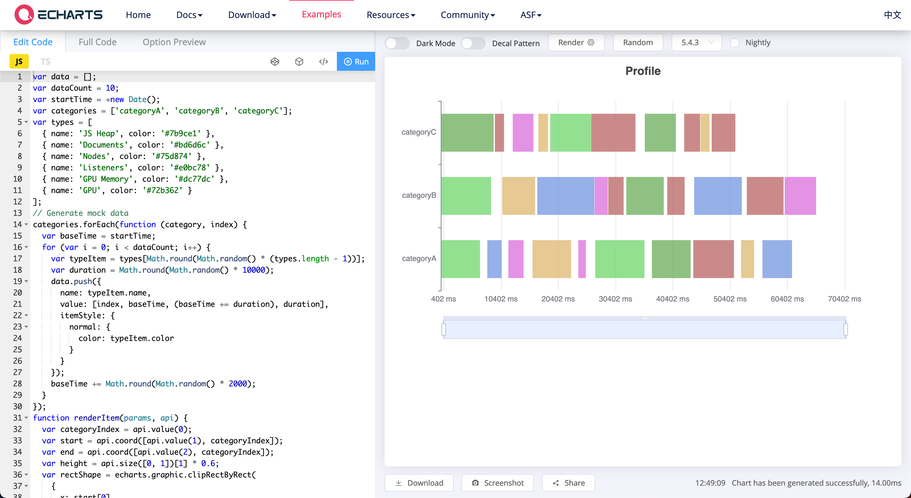
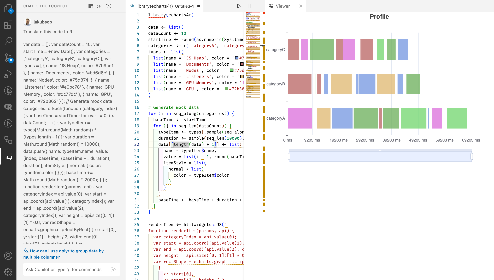

🤕 2 hours of debugging can save you 5 minutes of reading documentation.

We all know that saying, but there are times when it may be the other way around. If we want to use a new library, it may be 2 hours of reading documentation before we get to code for 5 minutes. What if we could skip the longer part and just do it in 5 minutes?

I’m not very familiar with ECharts, but we found an example that looked close enough to what we needed to implement in our Shiny app.

We wanted to see if ECharts will indeed support all the features we need to meet the requirements. The problem was that all examples were written in JavaScript. Even if it’s possible to implement the plot with ECharts, how do we bring it to a Shiny app?

🤔 Should we just grab the example and develop it in JavaScript, or should we try to recreate it with a wrapper R library — echarts4r?

Both options had their risks, ones that probably wouldn’t be spotted until a later development stage. If we go with JavaScript implementation, we’d need to add our own logic of sending data to the plot from the server. If we go with echarts4r, there’s a risk that some features won’t be supported.

😎 So we decided to try both approaches and see how it goes.

We continued developing the plot in JavaScript as the safer option — we know that all features the library has to offer should work. But we also tried echarts4r. Rewriting the example from JavaScript to R would take a lot of time and focus to not mess it up.

🤖 We simply asked Copilot Chat to rewrite the example code to R.

It already knew it should use echarts4r to implement it, and it took only a minute to spot a bug that prevented the example from running. Next, we just had to ask the Copilot a few more questions:

→ “How to add a secondary X axis?”

→ “How to add a tertiary X axis?”

→ “How to show X axis labels once per month”?

→ “How to not overlap axes labels?”

Within just a few minutes, we had a way bigger confidence that echarts4r will support all features we need. (Thanks John Coene! 🤝)

⏳ Using a tool like this can be a huge time saver that you should consider using when researching implementation options.

It was definitely worth it, as we saved a lot of time on not browsing documentation pages. It won’t always produce exactly what you need, though.

→ It can produce code that’s not runnable — it will require you to debug it.

→ It will hallucinate from time to time — like when it tried to use an interface that doesn’t exist.

→ It will produce code that may be not in your style of writing.

This approach has its downsides, but this case is exactly how you should be using AI assistance — to iterate fast and save time.

